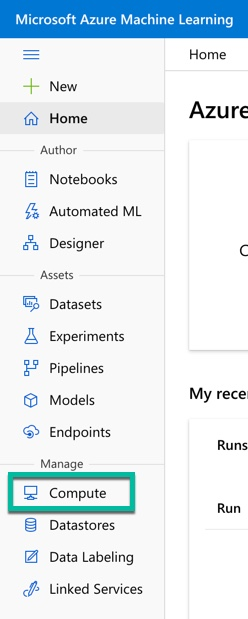
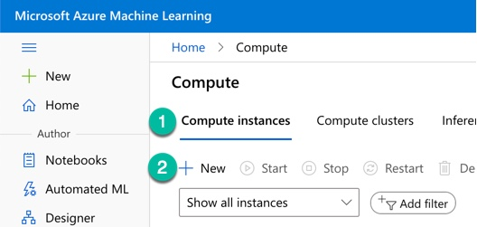
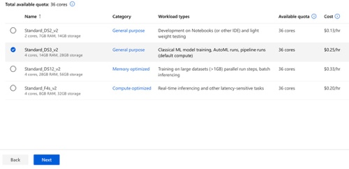
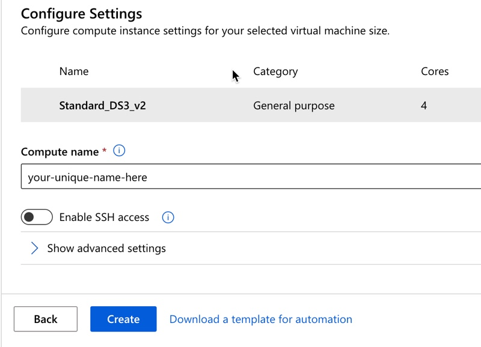
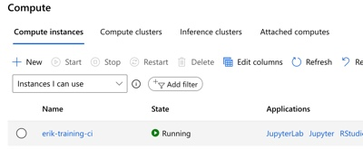

# Creating Azure Machine Learning Compute Instance

Compute instances (CI) are user-specific, Linux-based virtual machines (VM) that allow you to take advantage of compute in the cloud. You can interact with these instances via Jupyter, RStudio, VSCode, or other SSH tools.

For this lab, we'll be leveraging CIs to streamline package management and provide a consistent environment to learn in. In this lab, each user will be creating their own CI.

The steps to create the CI are:
1. Navigate to https://ml.azure.com and login with your Active Directory (AD) credentials.
1. Click on 'Compute' in the left navigation pane.
     
1. In the 'Compute Instances' tab (Step 1), click on 'New' (Step 2)
     
1. Select a Virtual Machine Size and then click 'Next'. 
    - For this training, the 'Standard_DS3_v2' should be sufficient.
     
1. Enter a name for your CI and click "Create"
    - The name must:
        - consist of upper and lower case letters, digits, and the - character. 
        - be between 3-24 characters long
        - be unique for the Azure Region (across all customers)
        - must not end with '-' or contain '-' followed by numbers
     
1. After a few minutes, you should see your CI in the 'Running' state. If you don't see it, change the filter selector to "Instances I can use".
     